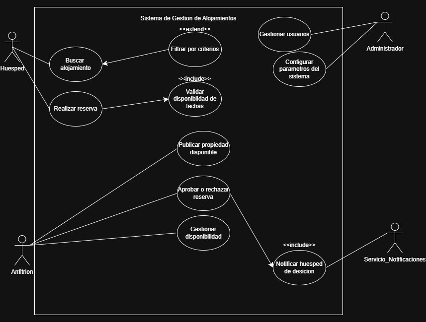

# Entrega 1 — Análisis del Sistema

**Grupo**: [Grupo 3]  
**Proyecto**: [Sistema de reserva de alojamiento]  
**Fecha de entrega**: 30/04/2026

---

## 1. Identificación de Actores

| Actor | Rol / Función en el sistema | Tipo (usuario final, sistema externo, etc.) |
|-------|-----------------------------|---------------------------------------------|
|Anfitrion       | Publica propiedades, gestiona disponibilidad, acepta o rechaza reservas, obtiene ingresos | Usuario final|
|Huesped         | Busca alojamientos, filtra por criterios y realiza reservas | Usuario final |  
|Administrador del sistema | Gestiona los usuarios y configura servicios del sistema  | Usuario interno |
|Sistema de notificaciones | Sistema externo encargado de enviar notificaciones por correo electrónico a huéspedes y anfitriones ante cambios de estado en reservas y recordatorios de check-in | Sistema externo|
|Sistema de pagos | Procesa los pagos y confirma transacciones de reservas | Sistema externo|

## 2. Requisitos Funcionales
| ID    | Descripción | Actor | HU relacionada |
|-------|-------------|-------|----------------|
| RF-01 |   El sistema debe permitir que el anfitrión registre y publique una propiedad      | Anfitrion | HU-01               |
| RF-02 |    El sisema debe permitir que el anfitrión edite los datos de una propiedad ya publicada      | Anfitrion | HU-01               |
| RF-03 |  El sisema debe permitir que el anfitrión configure los horarios de disponibilidad de una propiedad al momento de publicarla | Anfitrion | HU-01               |
| RF-04 |  El sistema debe permitir que el anfitrión modifique los horarios de disponibilidad de una propiedad ya publicada | Anfitrion | HU-01               |
| RF-05 |   El sistema debe permitir que el huésped visualice el listado de propiedades publicadas       |  Huésped |  HU-02              |
| RF-06 |  El sistma debe permitir que el huésped filtre las publicaciones de propiedades segun criterios de busqueda |  Huésped |  HU-02              |
| RF-07 |   El sistema debe permitir que el huésped realice una reserva sobre una propiedad publicada |  Huésped |  HU-02              |
| RF-08 |    El sistema debe permitir que el huésped cancele una reserva realizada previamente |  Huésped |  HU-02              |
| RF-09 |    El sistema debe permitir que el administrador cargue y gestione los datos de los anfitriones registrados | Administrador de sistema |         HU-03       |
| RF-10 |   El sistema debe permitir que el administrador cargue y gestione los datos de los huespedes registrados | Administrador de sistema |         HU-03       |
| RF-11 |   El sistema debe permitir que el administrador visualice  y gestione todas las reservas registradas | Administrador de sistema |         HU-03       |

> Cada requisito debe describir una acción concreta: "El sistema debe permitir que [actor] [acción]..."

## 3. Requisitos No Funcionales

| ID     | Categoría (rendimiento, seguridad, usabilidad, etc.) | Descripción |
|--------|------------------------------------------------------|-------------|
| RNF-01 | Usabilidad  | El sistema debe ser claro e intuitivo, permitiendo que un usuario nuevo pueda completar una reserva en un maximo de 3 pasos|
| RNF-02 | Usabilidad | El sistema debe ser accesible desde los principales navegadores web en el 100% de los casos | 
| RNF-03 | Usabilidad | El sistema debe permitir a los huespedes realizar o modificar una reserva en un tiempo maximo de 2 minutos | 
| RNF-04 | Rendimiento | El sistema debe mostrar la disponibilidad y  confirmacion de alojamientos en un maximo de 2 segundos|
| RNF-05 | Rendimiento | El sistema debe evitar la sobreventa de alojamientos, garantizando un 0% de reservas duplicadas para una misma propiedad en el mismo periodo |
| RNF-06 | Rendimiento  | El sistema debe procesar las reservas en una tasa menor al 1% de errores o inconsistencias | 
| RNF-07 | Seguridad | El sistema debe requerir un metodo de autenticacion en el 100% de los accesos a funcionalidades privadas |
| RNF-08 | Seguridad | El sistema debe garantizar una consistencia de los datos en el 100% de las operaciones de reserva | 
| RNF-09 | Seguridad | El sistema debe restringir el acceso a funcionalidades segun el rol del usuario en el 100% de los casos | 

## 4. Historias de Usuario

| ID    | Como...       | Quiero...                  | Para...                            |
|-------|---------------|----------------------------|------------------------------------|
| HU-01 | Huesped | Gestionar mi perfil personal   | Mantener mis datos actualizados dentro de la plataforma   |
| HU-02 | Huesped | Explorar propiedades disponibles                        | Encontrar alojamientos que se ajusten a mis necesidades |
| HU-03 | Huesped | Filtrar propiedades por ubicacion, fechas y precio | Acotar los resultados y tomar una decision mas rapida |
| HU-04 | Huesped | Realizar una reserva | Asegurar mi estadia en las fechas que necesito|
| HU-05 | Huesped | Modificar una reserva | Adaptar mi estadia si mis planes cambian |
| HU-06 | Huesped | Cancelar una reserva | Liberarme del compromiso si ya no puedo viajar |
| HU-07 | Huesped | Ver el historial de mis reservas | Consultar mis estadias anteriores y actuales |
| HU-08 | Huesped | Recibir notificaciones sobre cambios en mis reservas | Mantenerme informado sin revisar constantemente el sistema |
| HU-09 | Anfitrion | Gestionar mi perfil personal | Mantener mis datos actualizados dentro de la plataforma |
| HU-10 | Anfitrion | Publicar una nueva propiedad | Ofrecer alojamiento a potenciales huespedes |
| HU-11 | Anfitrion | Editar la informacion de mis propiedades | Mantener los datos actualizados y correctos |
| HU-12 | Anfitrion | Eliminar una propiedad | retirarla del sistema cuando ya no este disponible | 
| HU-13 | Anfitrion | Gestionar la disponibilidad de mis propiedades | Controlar las fechas disponibles y evitar conflictos de reserva
| HU-14 | Anfitrion | Aprobar o rechazar solicitudes de reserva | Decidir quien puede hospedarse en mi propiedad |
| HU-15 | Anfitrion | Recibir notificaciones de nuevas reservas o cambios de estado | Responder rapidamente |
| HU-16 | Administrador | Gestionar usuarios y roles | Mantener el orden y la seguridad del sistema |
| HU-17 | Administrador | Gestionar el catalogo de servicios disponibles | Definir las comodidades que pueden ofrecer los anfitriones |
| HU-18 | Administrador | Monitorear errores del sistema | Detectar fallas y mantener la plataforma funcionando correctamente |
| HU-19 | Administrador | Configurar parametros globales del sistema | Adaptar reglas y restricciones de la plataforma |

## 5. Diagrama de Casos de Uso

> Insertar imagen del diagrama exportado desde Draw.io, Lucidchart, StarUML o similar.  
> Guardar la imagen en esta misma carpeta (`docs/`) y referenciarla abajo.

## 6. Especificación de Casos de Uso

### CU-01 — [publicar propoiedad disponible]

| Campo | Detalle |
|---|---|
| **Actor principal** |anfrition |
| **Descripción** |permite al anfitrion cargar una nueva propiedad al sistema para que este disponible para alquiler |
| **Precondiciones** |el anfitrion debe haber iniciado sesion y tener su perfil verificado|
| **Postcondiciones (criterios de aceptación)** |la propiedad se visualiza en los resultados de busqueda de los huespedes|

| Secuencia Normal (Camino feliz) | Excepciones / Alternativas |
|---|---|
| 1. el anfitrion selecciona "publicar propiedad"   |
| 2. el sistema muestra un formulario de carga  |
| 3. el anfitrion ingresa fotos, descripcion y precio|  |3.1 si faltan datos obligatorios el sistema marca los campos en rojo y no permite avanzar| 
| 4. el anfitrion confirma la publicacion | 
| 5. el sistema valida los datos y guarda la propiedad | |5.1 si las imagenes exceden el tamaño permitido, el sitema solicita comprimirlas 

### CU-02 — [gestionar disponibilidad]

| Campo | Detalle |
|---|---|
| **Actor principal** |anfitrion |
| **Descripción** |permite al anfitrion modificar el calendario de sus propiedades |
| **Precondiciones** |el anfitrion debe tener al menos una propiedad publicada|
| **Postcondiciones (criterios de aceptación)** |el calendario de la propiedad se actualiza y los cambios se reflejan inmediatamente el la busqueda de los huespedes|

| Secuencia Normal (Camino feliz) | Excepciones / Alternativas |
|---|---|
| 1. el anfitrion selecciona la propiedad que desea gestionar|  |
| 2. el sistema muestra el calendario de disponibilidad de dicha propiedad|  | 
| 3. el anfitrion selecciona un rango de fechas o dias| 
| 4. el anfitrion elige la accion (marcar como no disponible o liberar fechas) | 
| 5. el anfitrion presiona guardar cambios | 
| 6. el sistema valida que no existan reservas confirmadas de esas fechas | 6.1 si hay una reserva confirmada en las fechas seleccionadas, el sistema impide el bloqueo y informa al anfitrion  | 
| 7.el sistema actualiza la base de datos y confirma el exito de la operacion | 7.1 si ocurre un error de red, el sistema muestra un mensaje de error| 

## CU-03: Buscar alojamiento

| Campo | Descripción |
| :--- | :--- |
| *ID + Nombre* | CU-03: Buscar alojamiento |
| *Actor principal* | Huéspedes |
| *Descripción* | El usuario busca opciones de alojamiento según ubicación y fechas. |
| *Precondiciones* | Ninguna (puede ser una búsqueda pública). |
| *Postcondiciones* | El sistema muestra una lista de propiedades que coinciden con los criterios. |

| Secuencia Normal (Camino feliz) | Excepciones / Alternativas |
| --- | --- |
| 1. El Huésped ingresa el destino y las fechas. | 
| 2.  El Sistema filtra las propiedades disponibles. | 2.1  Si no hay resultados, el sistema sugiere ciudades cercanas o cambiar fechas. |
| 3. | El Sistema muestra el listado de opciones. 

### CU-04: Filtra por criterios (Extend de CU-03)

| Campo | Descripción |
| :--- | :--- |
| *ID + Nombre* | *CU-04: Filtra por criterios* |
| *Actor principal* | Huéspedes |
| *Descripción* | Permite al usuario refinar los resultados de búsqueda aplicando filtros específicos (precio, servicios, tipo de alojamiento). |
| *Precondiciones* | El usuario debe haber realizado una búsqueda previa (CU-03) y estar en la pantalla de resultados. |
| *Postcondiciones* | La lista de alojamientos se actualiza mostrando solo aquellos que cumplen con los criterios seleccionados. |  

*Flujo de Eventos:*

| Secuencia Normal (Camino feliz) | Excepciones / Alternativas |
| :--- | :--- |
| 1. El Huésped selecciona la opción "Ver Filtros". | |
| 2. El Sistema despliega las opciones disponibles (Rango de precio, cantidad de habitaciones, WiFi, etc.). | |
| 3. El Huésped marca los filtros deseados y presiona "Aplicar". | |
| 4. El Sistema valida los criterios y actualiza la lista de resultados. | *4.1* Si ningún alojamiento coincide con los filtros, el sistema muestra el mensaje: "No hay resultados para esta combinación" y ofrece limpiar filtros. |

### CU-05: Realizar reserva

| Campo | Descripción |
| :--- | :--- |
| *ID + Nombre* | *CU-05: Realizar reserva* |
| *Actor principal* | Huéspedes |
| *Descripción* | Permite al huésped solicitar formalmente la reserva de un alojamiento para fechas determinadas. |
| *Precondiciones* | El Huésped debe haber iniciado sesión y seleccionado una propiedad disponible. |
| *Postcondiciones* | Se registra la solicitud en el sistema y se notifica al Anfitrión para su aprobación. |

*Flujo de Eventos:*

| Secuencia Normal (Camino feliz) | Excepciones / Alternativas |
| :--- | :--- |
| 1. El Huésped presiona el botón "Reservar" en la página del alojamiento. | 
| 2. El Sistema muestra el resumen de la reserva, incluyendo fechas y desglose de precio total. | |
| 3. El Huésped confirma los datos y presiona "Confirmar Reserva". | |
| 4. El Sistema verifica la disponibilidad por última vez para evitar sobreventas. | *4.1* Si el alojamiento ya no está disponible, el sistema informa del error y cancela la operación. |
| 5. El Sistema genera la reserva en estado "Pendiente" y envía una notificación al Anfitrión. | *5.1* Si ocurre un error en el servidor de correos, la reserva se guarda igual pero se muestra un aviso de "Error al enviar notificación". |

### CU-06: Gestionar usuarios
| Campo | Descripción |
| :--- | :--- |
| *ID + Nombre* | *CU-06: Gestionar usuarios* |
| *Actor principal* | Administrador de sistemas |
| *Descripción* | Permite administrar las cuentas de Huéspedes y Anfitriones (altas, bajas, bloqueos o modificaciones). |
| *Precondiciones* | El Administrador debe estar autenticado con permisos de nivel "Súper Usuario". |
| *Postcondiciones* | Los cambios en los perfiles se actualizan en la base de datos de forma permanente. |

*Flujo de Eventos:*
| Secuencia Normal (Camino feliz) | Excepciones / Alternativas |
| :--- | :--- |
| 1. El Administrador ingresa al panel de gestión de usuarios. | |
| 2. Busca un usuario por nombre, email o ID. | *2.1* Si el usuario no existe, el sistema muestra "Sin coincidencias". |
| 3. El Administrador selecciona una acción (ej: Suspender cuenta por mal comportamiento). | |
| 4. El Sistema solicita confirmación del cambio. | |
| 5. El Administrador confirma la acción. | |
| 6. El Sistema actualiza el estado del usuario y registra el log de la acción. | |

### CU-07: Configurar parámetros del sistema
| Campo | Descripción |
| :--- | :--- |
| *ID + Nombre* | *CU-07: Configurar parámetros del sistema* |
| *Actor principal* | Administrador de sistemas |
| *Descripción* | Permite ajustar valores globales como comisiones, límites de fotos por propiedad o términos de servicio. |
| *Precondiciones* | El sistema debe estar en modo mantenimiento o con acceso a configuración global. |
| *Postcondiciones* | Las nuevas reglas de negocio se aplican a todos los usuarios del sistema. |

*Flujo de Eventos:*
| Secuencia Normal (Camino feliz) | Excepciones / Alternativas |
| :--- | :--- |
| 1. El Administrador accede a la sección "Configuración Global". | |
| 2. Modifica un parámetro (ej: Cambiar comisión de reserva del 10% al 12%). | |
| 3. El Administrador presiona "Guardar y Aplicar". | |
| 4. El Sistema valida que los valores sean lógicos. | *4.1* Si se ingresa un valor fuera de rango (ej: comisión negativa), el sistema rechaza el cambio. |
| 5. El Sistema reinicia los parámetros y aplica los cambios en tiempo real. | |
| 6. El sistema ofrece al anfitrión asociar servicios disponibles al alojamiento (include: Asociar servicios de alojamiento).  |6.1 Si el anfitrión omite este paso, la propiedad se publica sin servicios asociados. |

### CU-08: Monitorea errores
 Campo | Descripción |
| :--- | :--- |
| *ID + Nombre* | CU-08: Validar disponibilidad de fechas |
| *Actor principal* | Sistema|
| *Descripción* | el sistema verifica que el alojamiento este libre en el rango de fechas seleccionadas, asegurado que no salen reservas previas ni bloqueos manuales |
| *Precondiciones* | El usuario ha seleccionado un alojamiento y un rango de fechas (entrada y salida) |
| *Postcondiciones* | Se confirma la disponibilidad para proceder con la reserva o se informa al usuario que las fechas no están disponibles |

*Flujo de Eventos:*
| Secuencia Normal (Camino feliz) | Excepciones / Alternativas |
| --- | --- |
| 1. El sistema recibe la solicitud de reserva con fechas seleccionadas | |
| 2. las fechas coinciden con una reserva ya confirmada: el sistema muestra "no disponible" |2.1 el sistema consulta el calendario del alojamiento |2.2 las fechas coinciden con un bloqueo del anfrition: el sistema muestra "fechas restringidas" |
| 3. El sistema verifica que no existan solapmientos con otros reservas obloqueos |  |
| 4. El sistema habilita el boton de "continuar con el pago/reserva| |

### CU-09: Aprobar o rechazar reserva
 Campo | Descripción |
| :--- | :--- |
| *ID + Nombre* |cu-09: aprobar o rechazar reserva  |
| *Actor principal* |Anfitrión |
| *Descripción* |Permite al anfitrión revisar una solicitud de reserva pendiente y decidir si la aprueba o rechaza.  |
| *Precondiciones* |El anfitrión debe estar autenticado y debe existir al menos una reserva en estado "Pendiente" sobre alguna de sus propiedades.  |
| *Postcondiciones* |La reserva cambia de estado a "Confirmada" o "Rechazada", y se dispara la notificación al huésped (CU-10).  |

*Flujo de Eventos:*

| Secuencia Normal (Camino feliz) | Excepciones / Alternativas |
| :--- | :--- |
| 1. El anfitrión accede a su panel de reservas pendientes. | |
| 2. El sistema muestra el listado de solicitudes con fechas, datos del huésped y precio. | |
| 3. El anfitrión selecciona una solicitud y elige "Aprobar" o "Rechazar". | |
| 4. El sistema solicita confirmación de la acción.  | 
| 5. El anfitrión confirma. | 
|6. El sistema actualiza el estado de la reserva e incluye CU-10. | 6.1 Si el anfitrión no responde en 48 horas, el sistema cancela automáticamente la solicitud y notifica al huésped.  |

### CU-10: Notificar huesped de desicion
 Campo | Descripción |
| :--- | :--- |
| *ID + Nombre* |cu-10: Notificar huesped de desicion   |
| *Actor principal* |Sistema de Notificaciones |
| *Descripción* |El sistema envía una notificación automática al huésped informando si su reserva fue aprobada o rechazada. Es un <<include>> de CU-09.  |
| *Precondiciones* |La reserva debe haber cambiado de estado como resultado de CU-09.  |
| *Postcondiciones* |El huésped recibe una notificación por correo con el resultado y, en caso de aprobación, los detalles de su estadía. |

*Flujo de Eventos:*

| Secuencia Normal (Camino feliz) | Excepciones / Alternativas |
| :--- | :--- |
| 1. El sistema detecta el cambio de estado de la reserva. | |
| 2. El sistema genera el mensaje correspondiente (aprobación o rechazo). | |
| 3. El sistema envía la notificación al correo del huésped vía Servicio de Notificaciones.  |3.1 Si el servidor de correos falla, el sistema reintenta el envío hasta 3 veces y registra el error en el log. |

### CU-11 — Login validado
| Campo | Descripción |
| :--- | :--- |
| *ID + Nombre* | *CU-11: Login valido |
| *Actor principal* | usuario |
| *Descripción* |El sistema permite al usuario ingresar sus credenciales y valida los datos antes de permitir el acceso. |
| *Precondiciones* |El usuario se encuentra en la pantalla de login. |
| *Postcondiciones* |Si los datos son válidos, el usuario puede continuar al sistema. Si son inválidos, se muestra un mensaje de error. |  

*Flujo de Eventos:*

| Secuencia Normal (Camino feliz) | Excepciones / Alternativas |
| :--- | :--- |
| 1.  |El usuario ingresa su email/usuario.| |
| 2. |El usuario ingresa su contraseña. | |
| 3. |El usuario presiona el botón de ingreso.|Si algún campo está vacío, el sistema muestra un mensaje solicitando completar los datos. |
|4.  |El sistema valida los datos ingresados. |4.1 Si las credenciales no son válidas, el sistema muestra un mensaje de error. |
|4.2 | |Si las credenciales no son válidas, el sistema muestra un mensaje de error. |
|4.3 | |Si ocurre un error durante el proceso, el sistema informa que no pudo realizar el ingreso. |
|5.  |El sistema determina si las credenciales son válidas. | |
|6.  |El sistema permite continuar al usuario. | |

### CU-12 — Listado desde datos
| Campo | Descripción |
| :--- | :--- |
| *ID + Nombre* | *CU-02: Listar alojamientos desde datos |
| *Actor principal* | usuario |
| *Descripción* |El sistema obtiene los alojamientos almacenados en un archivo JSON y genera dinámicamente el listado de propiedades. |
| *Precondiciones* |El usuario accede al catálogo. El archivo de datos debe estar disponible. |
| *Postcondiciones* |El catálogo muestra las propiedades disponibles o informa que no existen alojamientos para mostrar. |  

*Flujo de Eventos:*

| Secuencia Normal (Camino feliz) | Excepciones / Alternativas |
| :--- | :--- |
| 1. |El usuario ingresa al catalogo | |
| 2. |El sistema muestra el estado de carga. | |
| 3. |catalogo.js realiza una solicitud mediante fetch. |3.1 Si no se puede acceder al archivo JSON, el sistema captura el error. |
|4.  |El sistema obtiene los datos del archivo JSON. |4.1 Si el archivo no contiene alojamientos, el sistema muestra un mensaje indicando que no hay alojamientos para mostrar. |
|4.2 ||Si ocurre un error al procesar los datos, el sistema muestra el estado de error.|
|5.  |El sistema convierte la respuesta a JSON. ||
|6.  |El sistema verifica que existan alojamientos.||
|7.  |El sistema genera las tarjetas de las propiedades||
|8.  |El sistema muestra el listado al usuario.||

### CU-13 — Realizar reserva
| Campo | Descripción |
| :--- | :--- |
| *ID + Nombre* | *CU-13: Realizar reserva |
| *Actor principal* | huesped |
| *Descripción* |El huésped completa los datos de una reserva y el sistema valida la información antes de registrarla. |
| *Precondiciones* |El huésped se encuentra en el detalle de una propiedad. |
| *Postcondiciones* |La reserva es registrada y se muestra en la lista de reservas con estado confirmado. |  

*Flujo de Eventos:*

| Secuencia Normal (Camino feliz) | Excepciones / Alternativas |
| :--- | :--- |
| 1.   |El huésped ingresa a la pantalla de detalle de una propiedad.||
| 2.   |El huésped selecciona una fecha de entrada.  |  |
| 3.   |El huésped selecciona una fecha de salida.  |  |
| 4.   |El huésped indica la cantidad de huéspedes.  |  |
| 5.   |El huésped envía el formulario.  |5.1 Si faltan fechas, el sistema muestra un mensaje debajo de los campos correspondientes.  |
| 5.2.   |  |Si faltan datos obligatorios, el sistema muestra un mensaje de error.  |
| 6.   |El sistema valida que los campos estén completos.  | Si la validación falla, la reserva no se registra. |
| 7.   |El sistema crea la reserva.  |Si los datos son correctos, se crea la reserva con estado CONFIRMADA.  |
| 8.   |El sistema agrega la reserva a la lista.  |  |
| 9.   |El sistema actualiza la interfaz.  |  |
| 10.  | El sistema informa que la reserva fue procesada correctamente. |  |

### CU-14 — Gestionar estados de interfaz
| Campo | Descripción |
| :--- | :--- |
| *ID + Nombre* | *CU-15: Gestionar estados de interfaz |
| *Actor principal* | usuario |
| *Descripción* |El sistema informa visualmente al usuario cuando se encuentra cargando información, cuando existen datos, cuando no existen datos o cuando ocurre un error. |
| *Precondiciones* |El usuario accede a una pantalla que requiere procesar información. |
| *Postcondiciones* |La interfaz refleja el estado correspondiente de la operación. |  

*Flujo de Eventos:*
| Secuencia Normal (Camino feliz) | Excepciones / Alternativas |
| :--- | :--- |
| 1.   |El usuario accede a una pantalla que necesita cargar información.  |  |
| 2.   |El sistema muestra el estado de carga.  |2.1 Mientras se obtienen los datos, se muestra un mensaje de carga.  |
| 3.   |El sistema obtiene/procesa los datos.  |3.1 Si no existen datos, se muestra un mensaje indicando que no hay información para mostrar  |
| 3.   |  |3.2 Si ocurre un error, se muestra un mensaje de error.  |
| 3.   |  |3.3 Si una acción del usuario es inválida, se muestra un mensaje de validación.  |
| 4.   |Si existen datos válidos, el sistema los muestra.  |4.1 Cuando una acción se completa correctamente, se muestra un mensaje de confirmación.  |
| 5.   |La interfaz pasa al estado de contenido disponible.  |  |

### CU-15: Crear cuenta de usuario
| Campo | Descripción |
| :--- | :--- |
| *ID + Nombre* | *CU-15: Crear cuenta de usuario* | 
| *Actor principal* | Visitante (Usuario no registrado) | 
| *Descripción* | Permitir a un visitante registrarse en el sistema ingresando sus datos personales y seleccionando el rol que desaea cumplir (Huesped o Anfitrion). |
| *Precondiciones* | El usuario no debe haber iniciado sesion. |
| *Postcondiciones* | El sistema crea la cuenta, almacena el rol seleccionado y permite el ingreso a la plataforma. |

*Flujo de Eventos*
| Secuencia Normal (Camino feliz) | Excepciones / Alternativas |
| :--- | :--- |
|1.| El usuario accede a la pantalla de "Crear Cuenta".|
|2.| El sistema muestra un formulario solicitando datos personales y la seleccion de rol. |
|3.| El usuario completa sus datos y marca si sera "Huesped" o "Anfitrion". | 3.1 Si el usuario deja campos vacios, el sistema le muestra mensajes de error debajo del campo correspondiente. | 
|4.| El usuario presiona el boton de registro. | 4.1 Si el formato del email es incorrecto, el sistema solicita un correo valido. |  
|5.| El sistema valida la informacion y verifica que el email no este registrado. | 5.1 Si el email ya existe, el sistema informa que la cuenta ya esta en uso. |  
|6.| El sistema guarda el nuevo usuario con su rol y lo redirige al Login. | 

---

> Repetir la ficha completa para cada caso de uso del diagrama.
> Las excepciones se numeran ligadas al paso del que se desvían (ej: 4.1 en la misma fila que el paso 4).
