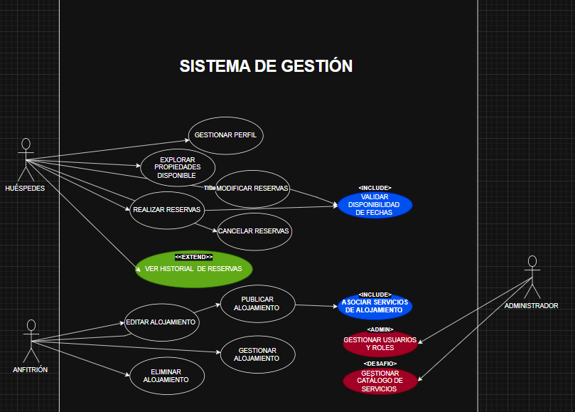

# Entrega 1 — Análisis del Sistema

**Grupo**: [Grupo 3]  
**Proyecto**: [Sistema de reserva de alojamiento]  
**Fecha de entrega**: 30/04/2026

---

## 1. Identificación de Actores

| Actor | Rol / Función en el sistema | Tipo (usuario final, sistema externo, etc.) |
|-------|-----------------------------|---------------------------------------------|
|Anfitrion       | Publica propiedades, gestiona disponibilidad, acepta o rechaza reservas, obtiene ingresos | Usuario final|
|Huesped         | Busca alojamientos, filtra por criterios y realiza reservas | Usuario final |  
|Administrador del sistema | Gestiona los usuarios y configura servicios del sistema  | Usuario interno |
    
## 2. Requisitos Funcionales

| ID    | Descripción | Actor | HU relacionada |
|-------|-------------|-------|----------------|
| RF-01 |    Debe poder publicar su propiedad y horarios        | Anfitrion     | HU-01               |
| RF-02 |   Debe poder filtrar y hacer reservas de las propiedades publicadas        |  Huesped     |  HU-02              |
| RF-03 |    cargar cada dato y reserva tanto de Huesped como de Anfitrion         | Administrador de sistema      |         HU-03       |

> Cada requisito debe describir una acción concreta: "El sistema debe permitir que [actor] [acción]..."

## 3. Requisitos No Funcionales

| ID     | Categoría (rendimiento, seguridad, usabilidad, etc.) | Descripción |
|--------|------------------------------------------------------|-------------|
| RNF-01 | Usabilidad  | El sistema debe ser claro e intuitivo, permitiendo que un usuario nuevo pueda completar una reserva en un maximo de 3 pasos|
| RNF-02 | Usabilidad | El sistema debe ser accesible desde los principales navegadores web en el 100% de los casos | 
| RNF-03 | Usabilidad | El sistema debe permitir a los huespedes realizar o modificar una reserva en un tiempo maximo de 2 minutos | 
| RNF-04 | Rendimiento | El sistema debe mostrar la disponibilidad y  confirmacion de alojamientos en un maximo de 2 segundos|
| RNF-05 | Rendimiento | El sistema debe evitar la sobreventa de alojamientos, garantizando un 0% de reservas duplicadas para una misma propiedad en el mismo periodo |
| RNF-06 | Rendimiento  | El sistema debe procesar las reservas en una tasa menor al 1% de errores o inconsistencias | 
| RNF-07 | Seguridad | El sistema debe requerir un metodo de autenticacion en el 100% de los accesos a funcionalidades privadas |
| RNF-08 | Seguridad | El sistema debe garantizar una consistencia de los datos en el 100% de las operaciones de reserva | 
| RNF-09 | Seguridad | El sistema debe restringir el acceso a funcionalidades segun el rol del usuario en el 100% de los casos | 

## 4. Historias de Usuario

| ID    | Como...       | Quiero...                  | Para...                            |
|-------|---------------|----------------------------|------------------------------------|
| HU-01 | Anfitrion   | Publicar propiedades que tengan disponibilidad.    | Obtener ingresos economicos.   |
| HU-02 | Huesped              | Buscar alojamiento.                           | Realizar la reserva. |
| HU-03 | Administrador del sistema | Gestionar y configurar el sistema de reservas. | Mantener estable el sistema sin errores. 

## 5. Diagrama de Casos de Uso

> Insertar imagen del diagrama exportado desde Draw.io, Lucidchart, StarUML o similar.  
> Guardar la imagen en esta misma carpeta (`docs/`) y referenciarla abajo.

![Diagrama de Casos de Uso] 

## 6. Especificación de Casos de Uso

### CU-01 — [publicar propoiedad disponible]

| Campo | Detalle |
|---|---|
| **Actor principal** |anfrition |
| **Descripción** |permite al anfitrion cargar una nueva propiedad al sistema para que este disponible para alquiler |
| **Precondiciones** |el anfitrion debe haber iniciado sesion y tener su perfil verificado|
| **Postcondiciones (criterios de aceptación)** |la propiedad se visualiza en los resultados de busqueda de los huespedes|

| Secuencia Normal (Camino feliz) | Excepciones / Alternativas |
|---|---|
| 1.  |el anfitrion selecciona "publicar propiedad"   |
| 2.  |el sistema muestra un formulario de carga  |
| 3.  |el anfitrion ingresa fotos, descripcion y precio  |3.1 si faltan datos obligatorios el sistema marca los campos en rojo y no permite avanzar| 
| 4. |el anfitrion confirma la publicacion | 
| 5. |el sistema valida los datos y guarda la propiedad |5.1 si las imagenes exceden el tamaño permitido, el sitema solicita comprimirlas 

### CU-02 — [gestionar disponibilidad]

| Campo | Detalle |
|---|---|
| **Actor principal** |anfitrion |
| **Descripción** |permite al anfitrion modificar el calendario de sus propiedades |
| **Precondiciones** |el anfitrion debe tener al menos una propiedad publicada|
| **Postcondiciones (criterios de aceptación)** |el calendario de la propiedad se actualiza y los cambios se reflejan inmediatamente el la busqueda de los huespedes|

| Secuencia Normal (Camino feliz) | Excepciones / Alternativas |
|---|---|
| 1.  |el anfitrion selecciona la propiedad que desea gestionar  |
| 2.  |el sistema muestra el calendario de disponibilidad de dicha propiedad  | 
| 3.  |el anfitrion selecciona un rango de fechas o dias| 
| 4. |el anfitrion elige la accion (marcar como no disponible o liberar fechas) | 
| 5. |el anfitrion presiona guardar cambios | 
| 6. |el sistema valida que no existan reservas confirmadas de esas fechas | 6.1 |si hay una reserva confirmada en las fechas seleccionadas, el sistema impide el bloqueo y informa al anfitrion  | 
| 7. |el sistema actualiza la base de datos y confirma el exito de la operacion | 7.1 |si ocurre un error de red, el sistema muestra un mensaje de error| 

## CU-03: Buscar alojamiento

| Campo | Descripción |
| :--- | :--- |
| *ID + Nombre* | CU-03: Buscar alojamiento |
| *Actor principal* | Huéspedes |
| *Descripción* | El usuario busca opciones de alojamiento según ubicación y fechas. |
| *Precondiciones* | Ninguna (puede ser una búsqueda pública). |
| *Postcondiciones* | El sistema muestra una lista de propiedades que coinciden con los criterios. |

| Secuencia Normal (Camino feliz) | Excepciones / Alternativas |
| --- | --- |
| 1. | El Huésped ingresa el destino y las fechas. | 
| 2. | El Sistema filtra las propiedades disponibles. | 2.1 | Si no hay resultados, el sistema sugiere ciudades cercanas o cambiar fechas. |
| 3. | El Sistema muestra el listado de opciones. 

### CU-04: Filtra por criterios (Extend de CU-03)

| Campo | Descripción |
| :--- | :--- |
| *ID + Nombre* | *CU-04: Filtra por criterios* |
| *Actor principal* | Huéspedes |
| *Descripción* | Permite al usuario refinar los resultados de búsqueda aplicando filtros específicos (precio, servicios, tipo de alojamiento). |
| *Precondiciones* | El usuario debe haber realizado una búsqueda previa (CU-03) y estar en la pantalla de resultados. |
| *Postcondiciones* | La lista de alojamientos se actualiza mostrando solo aquellos que cumplen con los criterios seleccionados. |

*Flujo de Eventos:*

| Secuencia Normal (Camino feliz) | Excepciones / Alternativas |
| :--- | :--- |
| 1. El Huésped selecciona la opción "Ver Filtros". | |
| 2. El Sistema despliega las opciones disponibles (Rango de precio, cantidad de habitaciones, WiFi, etc.). | |
| 3. El Huésped marca los filtros deseados y presiona "Aplicar". | |
| 4. El Sistema valida los criterios y actualiza la lista de resultados. | *4.1* Si ningún alojamiento coincide con los filtros, el sistema muestra el mensaje: "No hay resultados para esta combinación" y ofrece limpiar filtros. |

### CU-05: Realizar reserva

| Campo | Descripción |
| :--- | :--- |
| *ID + Nombre* | *CU-05: Realizar reserva* |
| *Actor principal* | Huéspedes |
| *Descripción* | Permite al huésped solicitar formalmente la reserva de un alojamiento para fechas determinadas. |
| *Precondiciones* | El Huésped debe haber iniciado sesión y seleccionado una propiedad disponible. |
| *Postcondiciones* | Se registra la solicitud en el sistema y se notifica al Anfitrión para su aprobación. |

*Flujo de Eventos:*

| Secuencia Normal (Camino feliz) | Excepciones / Alternativas |
| :--- | :--- |
| 1. El Huésped presiona el botón "Reservar" en la página del alojamiento. | |
| 2. El Sistema muestra el resumen de la reserva, incluyendo fechas y desglose de precio total. | |
| 3. El Huésped confirma los datos y presiona "Confirmar Reserva". | |
| 4. El Sistema verifica la disponibilidad por última vez para evitar sobreventas. | *4.1* Si el alojamiento ya no está disponible, el sistema informa del error y cancela la operación. |
| 5. El Sistema genera la reserva en estado "Pendiente" y envía una notificación al Anfitrión. | *5.1* Si ocurre un error en el servidor de correos, la reserva se guarda igual pero se muestra un aviso de "Error al enviar notificación". |

### CU-06: Gestionar usuarios
| Campo | Descripción |
| :--- | :--- |
| *ID + Nombre* | *CU-06: Gestionar usuarios* |
| *Actor principal* | Administrador de sistemas |
| *Descripción* | Permite administrar las cuentas de Huéspedes y Anfitriones (altas, bajas, bloqueos o modificaciones). |
| *Precondiciones* | El Administrador debe estar autenticado con permisos de nivel "Súper Usuario". |
| *Postcondiciones* | Los cambios en los perfiles se actualizan en la base de datos de forma permanente. |

*Flujo de Eventos:*
| Secuencia Normal (Camino feliz) | Excepciones / Alternativas |
| :--- | :--- |
| 1. El Administrador ingresa al panel de gestión de usuarios. | |
| 2. Busca un usuario por nombre, email o ID. | *2.1* Si el usuario no existe, el sistema muestra "Sin coincidencias". |
| 3. El Administrador selecciona una acción (ej: Suspender cuenta por mal comportamiento). | |
| 4. El Sistema solicita confirmación del cambio. | |
| 5. El Administrador confirma la acción. | |
| 6. El Sistema actualiza el estado del usuario y registra el log de la acción. | |

### CU-07: Configurar parámetros del sistema
| Campo | Descripción |
| :--- | :--- |
| *ID + Nombre* | *CU-07: Configurar parámetros del sistema* |
| *Actor principal* | Administrador de sistemas |
| *Descripción* | Permite ajustar valores globales como comisiones, límites de fotos por propiedad o términos de servicio. |
| *Precondiciones* | El sistema debe estar en modo mantenimiento o con acceso a configuración global. |
| *Postcondiciones* | Las nuevas reglas de negocio se aplican a todos los usuarios del sistema. |

*Flujo de Eventos:*
| Secuencia Normal (Camino feliz) | Excepciones / Alternativas |
| :--- | :--- |
| 1. El Administrador accede a la sección "Configuración Global". | |
| 2. Modifica un parámetro (ej: Cambiar comisión de reserva del 10% al 12%). | |
| 3. El Administrador presiona "Guardar y Aplicar". | |
| 4. El Sistema valida que los valores sean lógicos. | *4.1* Si se ingresa un valor fuera de rango (ej: comisión negativa), el sistema rechaza el cambio. |
| 5. El Sistema reinicia los parámetros y aplica los cambios en tiempo real. | |

### CU-08: Monitorea errores
| Campo | Descripción |
| :--- | :--- |
| *ID + Nombre* | *CU-08: validar disponibilidad de fechas* |
| *Actor principal* | usuario/sistema |
| *Descripción* | el sistema verifica que el alojamiento este libre en el rango de fechas seleccionado, asegurado que no exiten reservas previas ni bloqueos manuales |
| *Precondiciones* | El usuario ha seleccionado un alojamiento y un rango de fechas (entrada y salida) |
| *Postcondiciones* | Se confirma la disponibilidad para proceder con el reserva o se informa al usuario que las fechas no estan disponibles |

*Flujo de Eventos:*
| Secuencia Normal (Camino feliz) | Excepciones / Alternativas |
| --- | --- |
| 1. El sistema recibe la solicitud de reserva con fechas seleccionadas | |
| 2. las fechas coinciden con una reserva ya confirmada: el sistema muestra "no disponible" |2.1 el sistema consulta el calendario del alojamiento |2.2 las fechas coinciden con un bloqueo del anfrition: el sistema muestra "fechas restringidas" |
| 3. El sistema verifica que no existan solapmientos con otros reservas obloqueos |  |
| 4. El sistema habilita el boton de "continuar con el pago/reserva| |

---

> Repetir la ficha completa para cada caso de uso del diagrama.
> Las excepciones se numeran ligadas al paso del que se desvían (ej: 4.1 en la misma fila que el paso 4).
